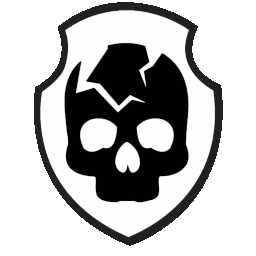

# a3-bskulls

Arma 3 faction/mod content for the Black Skulls across multiple eras.

## Contents

- `bskulls-modern`: modern-era faction content, including vehicles, weapons, groups, identities, scripts, textures, and thumbnails
- `bskulls-coldwar`: cold war-era faction content and supporting assets
- `bskulls-nam`: Vietnam-era faction content and supporting assets
- `discarded`: reference and study material that is kept for context, not as active addon content

## Repository shape

This repository intentionally preserves the existing addon layout in place. Repo-level improvements should avoid reorganizing addon content unless that work is explicitly approved first.

## Dependencies

These addons depend on Arma 3 base content plus third-party mods. The exact dependency set varies by addon and should be checked in each addon's `CfgPatches.hpp`.

## Development workflow

1. Make focused changes.
2. Avoid broad structural edits to existing addon directories unless explicitly approved.
3. Keep commit messages in Conventional Commit format.
4. Run repository hygiene checks before opening a pull request.

## Contributing

See [CONTRIBUTING.md](CONTRIBUTING.md) for commit conventions, review expectations, and repo safety rules.

## License

This repository is licensed under
[CC BY-NC-ND 4.0](https://creativecommons.org/licenses/by-nc-nd/4.0/).

In short: attribution is required, commercial use is not allowed, and
redistribution of modified versions is not allowed under this license.
