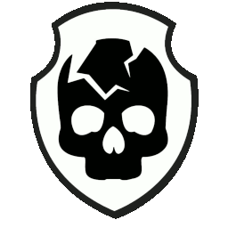

# The Black Skulls Faction (Ex Tenebris)

[](https://creativecommons.org/licenses/by-nc-nd/4.0/)

Black Skulls is an Arma 3 faction mod project that packages the group across multiple eras instead of as a single all-in-one setting. Each addon focuses on a different time period, with its own units, groups, vehicles, weapons, identities, scripts, textures, and editor assets.



## Addons

- `bskulls-modern`: present-day / near-contemporary faction content
- `bskulls-coldwar`: Cold War-era faction content
- `bskulls-nam`: Vietnam-era faction content

These are released as separate addons and versioned independently.

## Install A Release In Arma 3

Each addon release currently ships as an individual `.pbo` file.

### Option 1: Arma 3 Launcher

1. Download the addon `.pbo` you want from the repository's Releases page.
2. Create a local mod folder somewhere on disk, for example:
   - `@bskulls-modern`
   - `@bskulls-coldwar`
   - `@bskulls-nam`
3. Inside that folder, create an `Addons` directory.
4. Copy the released `.pbo` into that `Addons` directory.
5. Open the Arma 3 Launcher.
6. Add the folder as a local mod and enable it in the launcher.

Example layout:

```text
@bskulls-modern/
  Addons/
    bskulls-modern_v<version>.pbo
```

### Option 2: Startup Parameter

You can also load the addon with Arma 3's `-mod=` startup parameter.

Example:

```text
-mod=@bskulls-modern
```

If you are loading multiple mods, separate them with semicolons.

Example:

```text
-mod=@CBA_A3;@bskulls-modern
```

## Dependencies

These addons depend on Arma 3 base content plus third-party mods. The dependency set is addon-specific, so check each addon's `CfgPatches.hpp` for the authoritative required addons list.

## Notes For Multiplayer Servers

All releases are signed. Each release includes:

- `.pbo`: the addon
- `.bisign`: the signature file, must sit alongside the `.pbo` in the mod's `Addons` folder
- `RoFz_bskulls.bikey`: the public key for server-side verification

Server-side setup:

- place the addon `.pbo` and its `.bisign` in the mod's `Addons` folder
- place `RoFz_bskulls.bikey` in the server's `keys` folder

## Repository Layout

- `bskulls-modern/`: Modern-era HEMTT project and addon content
- `bskulls-coldwar/`: Cold War-era HEMTT project and addon content
- `bskulls-nam/`: Vietnam-era HEMTT project and addon content
- `tools/`: repository-level validation and maintenance tools
- `discarded/`: reference and study material kept for context, not for active builds
- `.devcontainer/`: pinned `a3-devcontainers` submodule
- `.github/workflows/`: CI and release automation

## Development Workflow

1. Make focused changes.
2. Avoid broad structural edits unless they are intentional and reviewed.
3. Use Conventional Commits.
4. Run `hemtt check` before opening a pull request.

### Dev Container Tooling

Clone the public faction repository, then initialize the shared environment if
you have authenticated access to the private `a3-devcontainers` repository:

```sh
git clone https://github.com/RoFz/a3-bskulls.git
cd a3-bskulls
git submodule update --init --recursive
```

`.devcontainer` pins an exact commit of the private, maintainer-only
[`a3-devcontainers`](https://github.com/RoFz/a3-devcontainers) repository.
Select the `arma3` configuration when VS Code prompts. The faction repository
remains available as a standalone public source clone; the maintainer's private
multi-repository workspace is not required.

The submodule is normally detached at the exact commit selected by this
repository. To change the shared environment, create a branch inside it first:

```sh
git -C .devcontainer fetch origin
git -C .devcontainer switch -c <branch-name> origin/main
```

Make, commit, and push the change from `.devcontainer`, then merge it in
`a3-devcontainers`. Update every affected consumer to that published commit:

```sh
git -C .devcontainer fetch origin
git -C .devcontainer switch --detach <shared-commit>
git add .devcontainer
git commit -m "chore(devcontainer): update shared Arma environment"
```

Repeat the pointer commit in each affected consumer (`a3-root`, `a3-bskulls`,
and `a3-scenarios`). Keep consumers pinned to reviewed commits; do not use a
floating branch or automatic `git submodule update --remote` updates.

The container installs HEMTT, armake2, pre-commit, GitHub CLI, and Java for the
`skacekachna.sqflint` extension. Let the post-create bootstrap finish before
opening `Cfg*.hpp` files. If SQFLint reports `spawn java ENOENT`, inspect the
bootstrap result before considering a rebuild; Java is installed by
`.devcontainer/arma3/post-create.sh`.

Codex runs in the container and stores its home in the shared
`a3-bskulls-codex` named volume, not in this repository. Cursor is not
supported.

For coupled faction/scenario work, the maintainer's private `a3-root` workspace
opens this repository beside the independent, currently private
`a3-scenarios` clone in one Dev Container window. Each repository retains its
own Git history, staging area, and commits.

### Local launcher test loop

The Dev Container binds host folders to stable container paths. Set every
variable to an existing host directory before creating or rebuilding the
container; no host-specific absolute path belongs in this public repository.

| Host environment variable | Container path | Purpose |
| --- | --- | --- |
| `A3_MODS_DIR` | `/arma3/mods` | Local `@bskulls-*` folders for launcher testing |
| `A3_RPT_DIR` | `/arma3/logs` | Arma 3 `.rpt` and log directory |
| `A3_WORKSHOP_DIR` | `/arma3/workshop` | Steam Workshop content for PBO/config inspection |
| `A3_DOCUMENTS_DIR` | `/arma3/documents` | Arma 3 documents, missions, and profiles |
| `A3_GAME_DIR` | `/arma3/game` | Arma 3 game installation |

Prepare these folders under `A3_MODS_DIR`:

```text
@bskulls-modern/Addons
@bskulls-coldwar/Addons
@bskulls-nam/Addons
```

Examples for a PowerShell session that will launch VS Code:

```powershell
$env:A3_MODS_DIR = "C:\Users\you\Documents\MyBuiltA3Mods"
$env:A3_RPT_DIR = "$env:LOCALAPPDATA\Arma 3"
$env:A3_WORKSHOP_DIR = "C:\Program Files (x86)\Steam\steamapps\workshop\content\107410"
$env:A3_DOCUMENTS_DIR = "$env:USERPROFILE\Documents\Arma 3"
$env:A3_GAME_DIR = "C:\Program Files (x86)\Steam\steamapps\common\Arma 3"
```

On macOS or Linux, export the same variables with paths appropriate to the
local Steam, Arma, or Proton installation. Fully quit VS Code after changing
persistent environment variables so `${localEnv:...}` values are refreshed.

Do not point `A3_WORKSHOP_DIR` at Arma's `!Workshop` directory. Its launcher
junctions do not resolve inside the container. Use
`steamapps/workshop/content/107410`, which contains the actual Workshop files.
Extract third-party content only under the gitignored `.workshop-extract/`
directory.

Personal `.crt` or `.pem` files may be placed under
`.devcontainer/arma3/.local-certs/`. That location is ignored by the shared
submodule repository but remains available to the local Docker build context.

From the repository root inside the container:

```text
make modern   # or: make cold / make nam / make all
```

Each target runs `hemtt build` in that project and copies unsigned local-test
PBOs into `/arma3/mods/@bskulls-*/Addons/`. Signed releases continue to come
only from Release Please and GitHub Actions on `main`.

### Dependency Audit

Use the local dependency audit to review `CfgPatches.requiredAddons[]` against actual config usage:

```text
python3 tools/audit_required_addons.py bskulls-modern/addons/bskulls-modern
```

The audit is report-only in v1. It uses:

- actual class references found in addon config and SQF files
- `tools/class_to_patch_map.json` for verified class-to-`CfgPatches` ownership

When a new external class appears, verify its owning patch in the upstream mod config and add it to the mapping file once. Then re-run the audit and update `requiredAddons[]` from the report.

You can also compare the static audit against a runtime-exported config snippet, for example an ALiVE ORBAT/autogen export that contains `requiredAddons[]`:

```text
python3 tools/audit_required_addons.py bskulls-modern/addons/bskulls-modern --runtime-cfg /path/to/autogen.hpp
```

That gives you two complementary signals:

- static source scanning catches inheritance and content references even when you have not loaded the modset in game
- runtime/oracle exports reflect what Arma reports from the live loaded config database

When those disagree, the report highlights the gaps so you can either:

- expand `tools/class_to_patch_map.json`
- correct `requiredAddons[]`
- or confirm the runtime export was scenario-specific and not a full addon dependency picture

## Contributing

See [CONTRIBUTING.md](CONTRIBUTING.md) for contribution rules, review expectations, and repository safety guidance.

## License

This repository is licensed under [CC BY-NC-ND 4.0](https://creativecommons.org/licenses/by-nc-nd/4.0/).

In short: attribution is required, commercial use is not allowed, and redistribution of modified versions is not allowed under this license.
